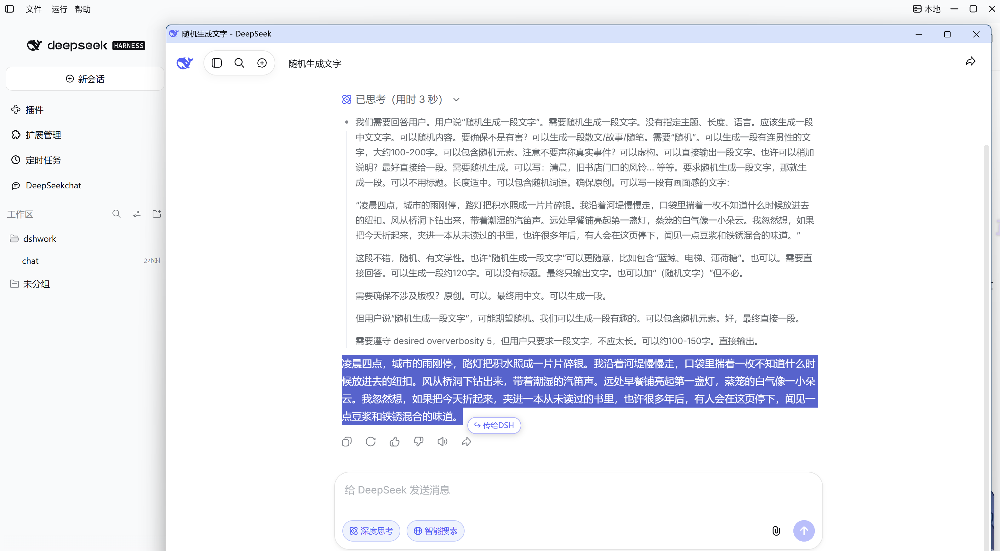
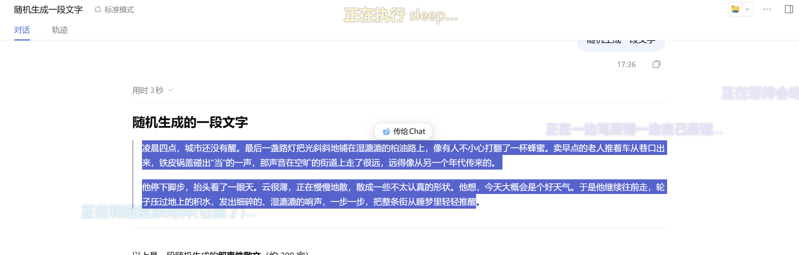

# dsh-deepseek-chat

在 [DSH（DeepSeek Harness）](https://github.com/deepseek-ai/deepseek-harness) 左侧边栏添加一个原生菜单项，
一键打开 **chat.deepseek.com** 独立窗口，支持与 DSH **双向划词互传**。

[](https://github.com/deepseek-ai/deepseek-harness)
[](./LICENSE)
[](https://github.com/topics/dsh-plugin)

---

## 🌟 特性亮点

- **一键直达** —— 左侧边栏原生菜单项，点击即开独立窗口，登录一次长期保留。
- **双向划词互传** —— DSH 里划词直接送进网页端；网页端划词一键接力回 DSH。
- **零依赖、免构建** —— 无 `node_modules`、无编译，装完重启即可用。
- **故障不静默** —— 打开失败、注入失败都会在右下角提示具体原因。





---

## 🚀 快速开始

**环境要求**：DSH ≥ `0.1.5-rc.3` · 系统装有 Chrome 或 Edge · Windows

**一条命令安装**：

```bash
dsh plugin --profile <profile> install 4869acdsh-a11y/dsh-DeepSeek-chat
```

装完**重启 DSH 实例**，再按 `Ctrl+Shift+R` 硬刷新页面。

> 也提供幂等的 `install.ps1` 安装脚本，详见[技术文档](docs/TECHNICAL.md)。

---

## 📖 使用指南

**打开窗口**

1. 点击左侧边栏的 **DeepSeek chat** 菜单项（侧边栏收起时，先点左上角展开）。
2. 首次在弹出的窗口里登录一次 DeepSeek，此后一直保持登录。


**双向划词互传**

1. 在 DSH 里选中文字 → 点 **🐋 传给Chat** → 送入网页端输入框。
2. 在网页端选中文字 → 点气泡 → 接力回 DSH 输入框。


---

## 🛠️ 常用设置

配置写在插件自身的 `cordis.patch.yml` 的 `config:` 下，改完需**重启 DSH 实例**生效。

| 配置项 | 默认值 | 说明 |
|---|---|---|
| `relayAppendMode` | `replace` | 接力写入方式；`append` 为追加 |
| `placement` | `over-dsh` | 窗口位置；`center` 交给系统放置 |
| `browserPreference` | `auto` | 浏览器选择；可强制 `chrome` 或 `edge` |
| `sidebarInset` | `268` | 窗口给侧边栏留的宽度；挡住侧边栏就调大 |
| `relay` | `true` | 划词互传总开关；设 `false` 彻底关闭 |

例如切换为追加模式：

```yaml
config:
  relayAppendMode: append
```

> [完整配置表](docs/TECHNICAL.md#完整配置项)见技术文档。

---

## ❓ 常见问题

**为什么是独立窗口，不直接嵌进 DSH？**

chat.deepseek.com 的站点安全策略（禁止 iframe 嵌入、WAF 机器人挑战、Cookie 限制）让「内嵌」技术上不可行。独立窗口是当前最接近的方案，详细分析见[技术文档](docs/TECHNICAL.md#为什么不能内嵌进-dsh)。

**为什么接力默认是覆盖，不是追加？**

追加会让草稿越攒越长，DSH 输入框变卡、内容重复出现；覆盖每次写入规模恒定，从机制上杜绝累积。确实要攒多条，就开 `append` 模式。

**菜单项点不动或找不到？**

- 侧边栏收起时菜单不可见，先展开侧边栏。
- 窗口可能开在其他显示器，或被别的窗口挡住。
- 看右下角提示，它会告诉你具体原因。

---

## 📄 更多

- [技术文档](docs/TECHNICAL.md) —— 安装脚本、卸载方式、完整配置表、实现原理

---

## 📝 更新日志

- **v1.0.0**（2026-09-29）初始版本正式发布。实现在 DSH 左侧边栏一键打开 DeepSeek 独立窗口，并支持双向划词互传。

---

## License

[MIT](./LICENSE)
